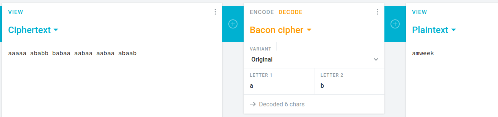

# Not Binary
## 40 points
### "00000 01011 10100 00100 00100 01001"

This challange is based on the "Bacon Cipher", if we substitute the 0's and 1's with a's and b's we get this:

`aaaaa ababb babaa aabaa aabaa abaab`

Then, if we use a online Bacon Cipher decoder we get the following:

Flag: `AM{amweek}`