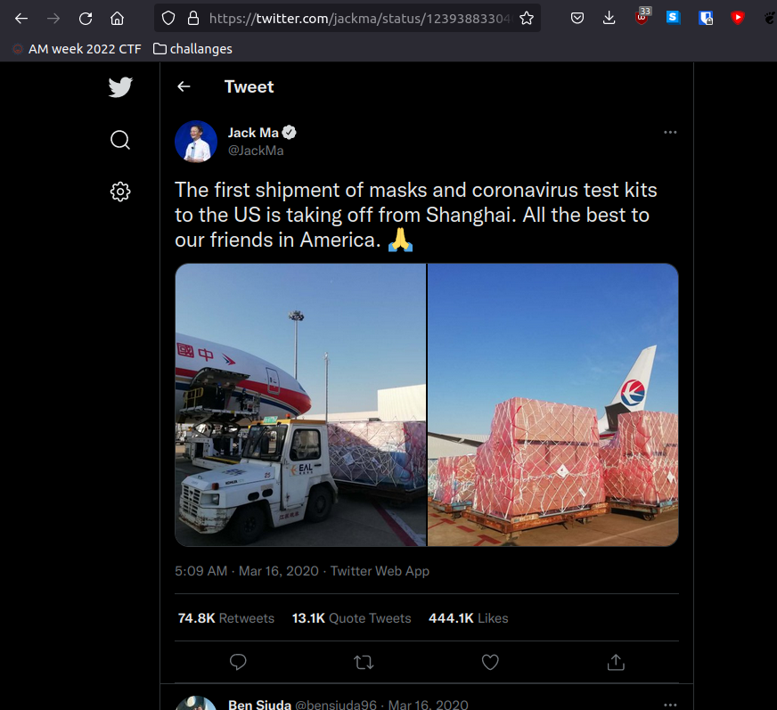
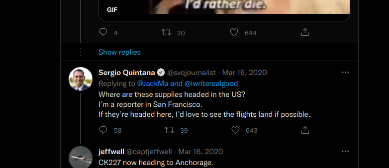

# Track me!
## 200 points
### "A reporter would like to know where this flight might be headed. Can you find out where this reporter lives?"

We are provided with a `Flight.jpg` image however this is a OSINT challange, not a steganography one, so we will have to do a little detective work. First, we can upload the image to a reverse image search engine like Google images to see if this file appears somewhere across the world wide web:

We can find a Twitter post from Jack Ma with the original image:

If we scroll a little trough the comments, we can see a reporter from `San Francisco` asking about the flight:

Flag: `AM{san_francisco}`