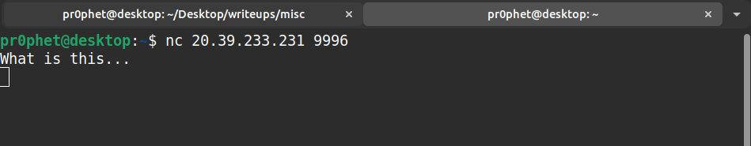
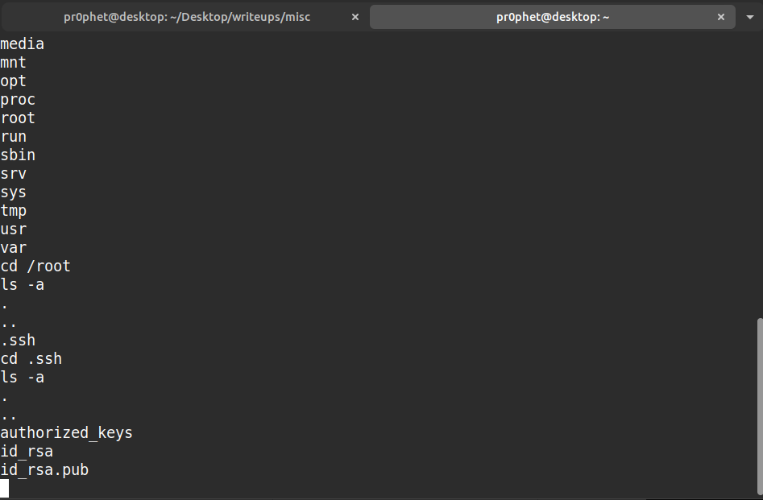
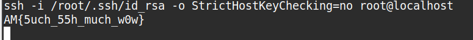

# What is this...
## 250 points
### "This does not feel right, it feels like I'm in... prison?!?!"
### "nc 20.39.233.231 9996"

This is a common chroot escape challange. We are given a shell where we can run commands:

If we do a little digging we can find a pair of ssh key in the `/root/.ssh` folder:

If we use the ssh keys like this `ssh -i /root/.ssh/id_rsa -o StrictHostKeyChecking=no root@localhost` we get the following message:

Flag: `AM{5uch_55h_much_w0w}`