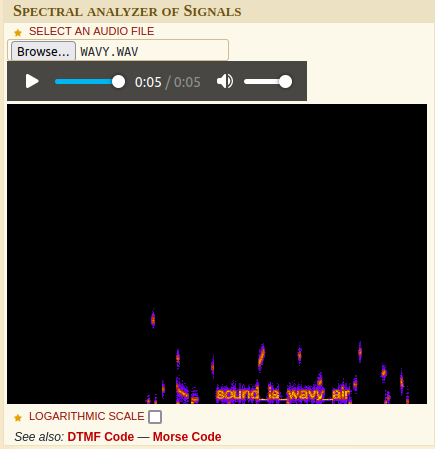

# But can you hear it...?
## 100 points
### "There is a message hidden in this file, can you retrive it?"

We are provided with a file `wavy.wav`, if we open it in an online spectrum analyzer we see the following:

Flag: `AM{sound_is_wavy_air}`