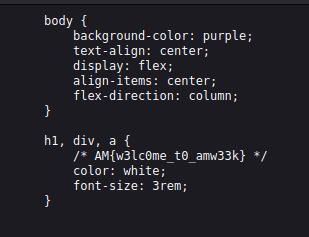

# cascade_flow
## 150 points
### "Welcome to AM week CTF!"
### "http://ctf.az.am-isd.com:9998/"

Once we access the link we see the following page:

This chalange is quite simple, all we have to do is "inspect element" and view the source of the css(cascading style sheets) file which the title was hinting to:

Flag: `AM{w3lc0me_t0_amw33k}`